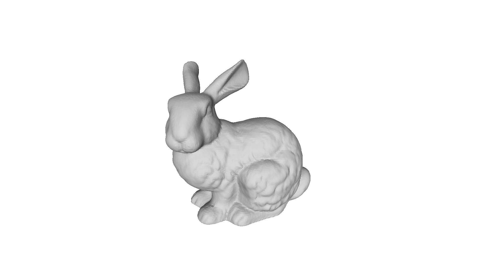
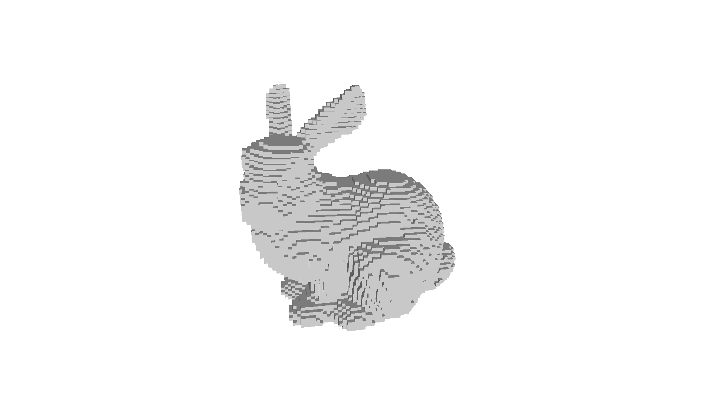
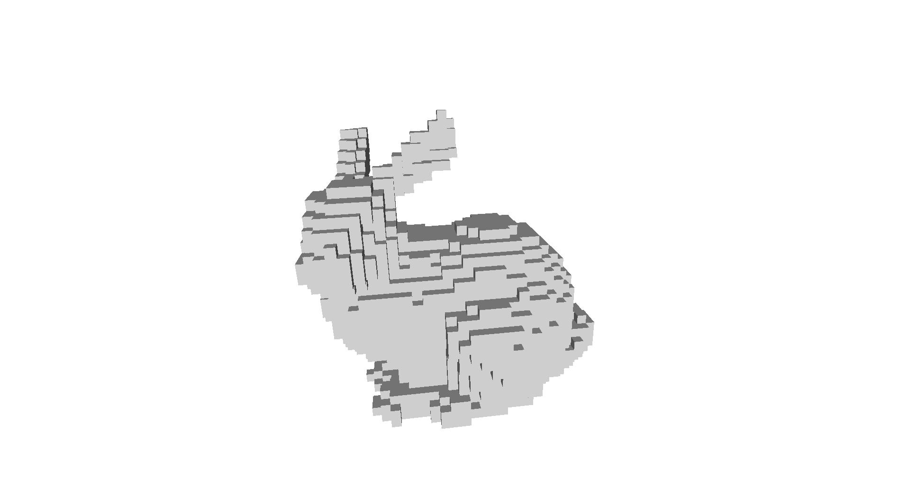
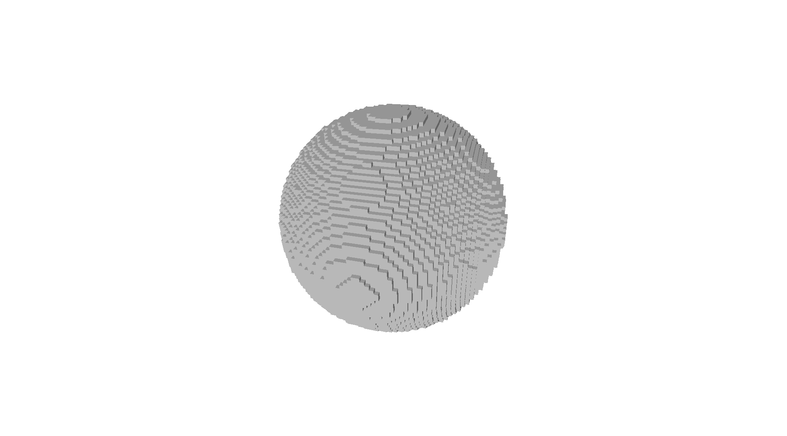
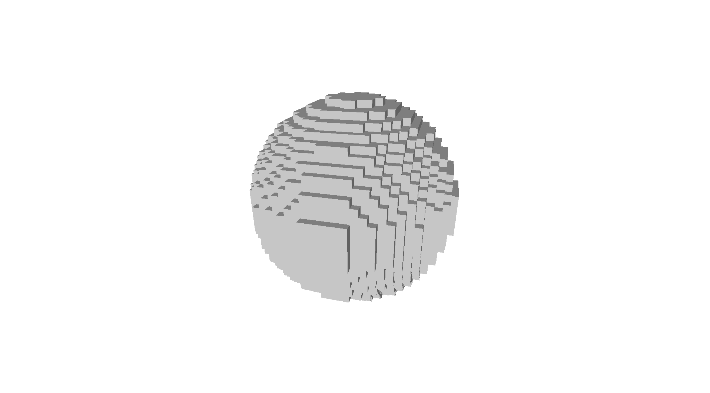
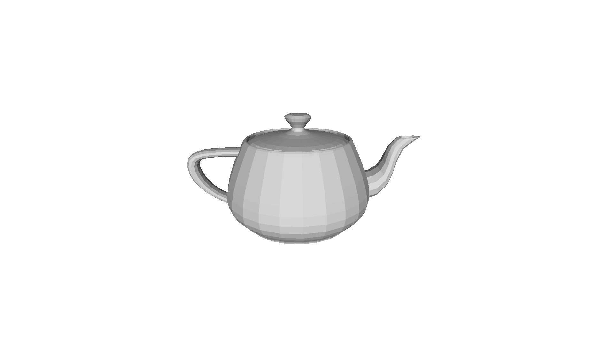
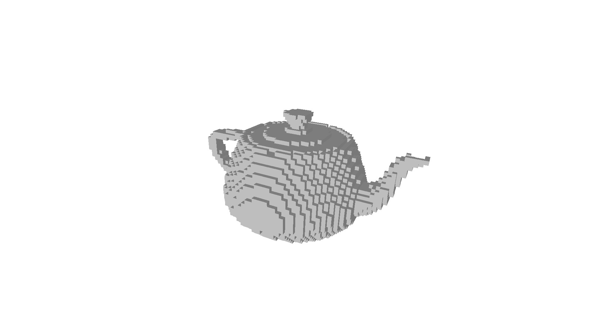
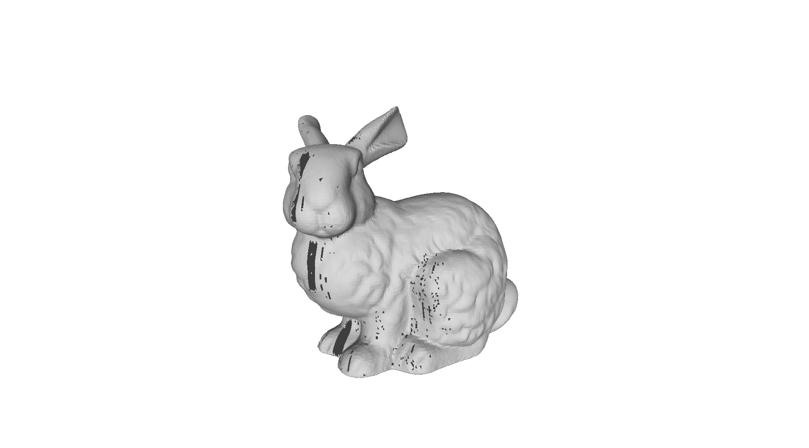
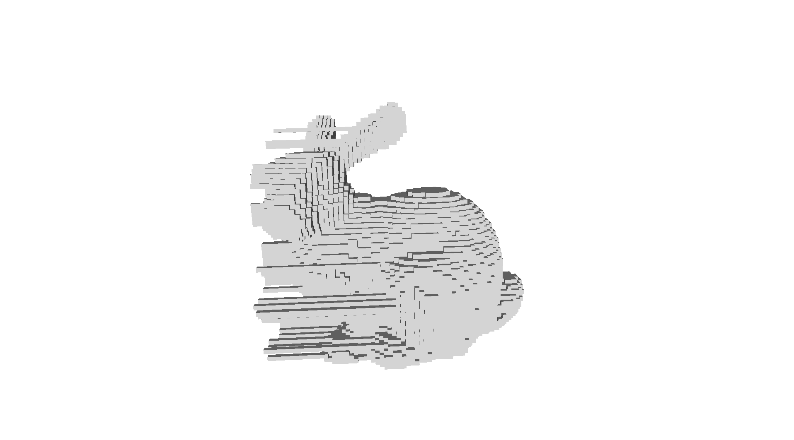
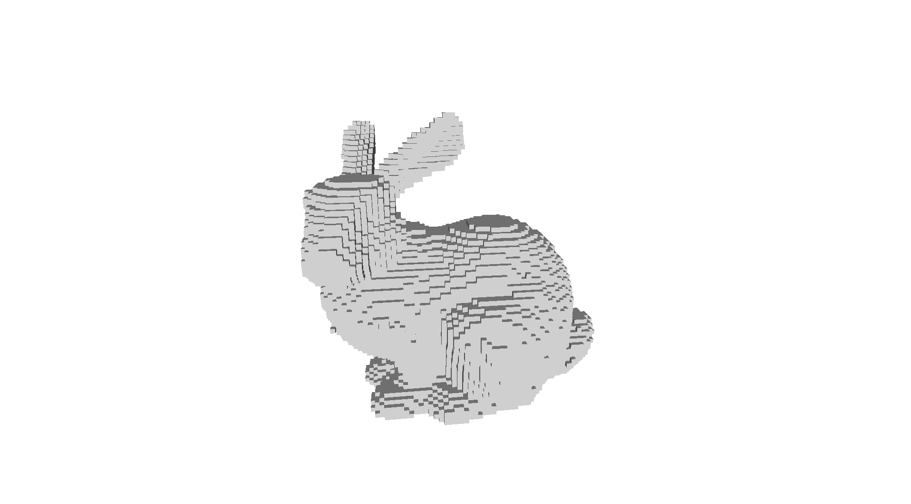

# CUDA C mesh voxelizer

This is a simple voxelization engine made for MIT's 6.807 Computational Fabrication. Given a .obj mesh, this will output a voxel grid in the form of another .obj file. This voxelizer relies on CUDA for acceleration of the inherently parallel voxelization process.

**WARNING**: this can generate some BIG files if you specify a .obj output and make your computer very sad. Keep the resolution below around 128 for safety. Higher can be achieved, but you will want to use binvox output.

Using resolution of 256 I generated a 4.7 GB voxel obj file containing over 67 million vertices. This just about crashed my computer as I obliterated my poor swap space. On the bright side, it only took <2 seconds to generate...

This voxelizer is built on:

- [Möller–Trumbore intersection algorithm](https://en.wikipedia.org/wiki/M%C3%B6ller%E2%80%93Trumbore_intersection_algorithm)
- CUDA

You can visualize the output file with MeshLab.

### Usage:

./voxelizer [options] [input path] [ouput path]

Options: 

    -s, --samples     : number of sample rays per vertex    

    -v, --verbose     : Verbosity level. Multiple flags for more verbosity.    

    -r, --resolution  : voxelization resolution (default 32)

    -f, --format      : output format - obj|binvox (default binvox)

    -d, --double      : treat mesh as double-thick

    -h, --help        : Displays usage information and exits.

Arguments:

    [input path] : path to .obj mesh

    [ouput path] : path to save voxel grid

Example usage: 

64x64x64 resolution, output to ./data/sphere/sphere_voxelized.binvox
```
./voxelizer -r 64 ./data/sphere/sphere.obj ./data/sphere/sphere_voxelized
```

64x64x64 with 11 randomized direction samples to work with a broken mesh
```
./voxelizer -r 64 -s 11 ./data/sphere/broken_sphere.obj ./data/sphere/broken_sphere_voxelized
```

### Build instructions:

You will need NVIDIA CUDA for this to compile properly.

```
mkdir build
cd build
cmake ..
make
```

### References

- This was very useful for implementing the GPU ray-triangle intersection [https://en.wikipedia.org/wiki/M%C3%B6ller%E2%80%93Trumbore_intersection_algorithm](https://en.wikipedia.org/wiki/M%C3%B6ller%E2%80%93Trumbore_intersection_algorithm)
- Last semester's graphics assignment in which I implemented ray-triangle intersection
- The CUDA documentation
- The given skeleton code
- binvox file format definition: [http://www.cs.princeton.edu/~min/binvox/binvox.html](http://www.cs.princeton.edu/~min/binvox/binvox.html)

### Known Problems

There are no known problems with the code. It gets a bit squirly if given very large resolutions, but that's not a surprise.

### Extra Credit

I implemented the voxelization algorithm on the GPU with CUDA. This gives a massive speedup - on the order of 400-2750 times faster than the sample executable.

Additionally, I implemented multiple sampling for incomplete blocks. Using the -s or --samples argument allows you to specify how many random directions are tested. There are also two different output formats. The standard obj format, as well as the more space efficient binvox format.

I added in the ability to process meshes that are (for whatever reason) double thickness. This is accomplished by using (num_intersections / 2) % 2 for occupancy determination.

### Notes

I liked this assignment!

### Benchmarks

I tested this out with the same parameters as the given executable for all of the given shapes (all with one sample). These are the results on my GTX970:

**GPU (NVIDIA GTX970)**

	teapot (2464 triangles) @ 64x64x64: 0.083 seconds (396x speedup)
	bunny (69664 triangles) @ 64x64x64: 0.88 seconds (2750x speedup)

	sphere (960 triangles) @ 128x128x128: 0.150 seconds
	teapot (2464 triangles) @ 128x128x128: 0.23 seconds
	bunny (69664 triangles) @ 128x128x128: 6.54 seconds

	sphere (960 triangles) @ 256x256x256: 0.825 seconds
	teapot (2464 triangles) @ 256x256x256: 2.043 seconds
	bunny (69664 triangles) @ 256x256x256: 51.96 seconds

	sphere (960 triangles) @ 512x512x512: 6.19 seconds
	teapot (2464 triangles) @ 512x512x512: 15.64 seconds
	bunny (69664 triangles) @ 512x512x512: 417.62 seconds
	dragon (100000 triangles) @ 512x512x512, 4 samples in: 2780.39 seconds

	(1 Billion voxels!)
	sphere (960 triangles) @ 1024x1024x1024: 49.93 seconds
	teapot (2464 triangles) @ 1024x1024x1024: 126.55 seconds


**CPU (Intel i5-4590, single threaded)**

	sphere (960 triangles) @ 64x64x64: 32.9294 seconds
	teapot (2464 triangles) @ 64x64x64: 84.0355 seconds
	bunny (69664 triangles) @ 64x64x64: 2419.65 seconds

### Pictures

Example mesh bunny

voxelized to 128x128x128 (with 5 samples)

voxelized to 64x64x64

voxelized to 32x32x32


Example mesh sphere

voxelized to 64x64x64

voxelized to 32x32x32


Example mesh teapot

voxelized to 64x64x64

voxelized to 32x32x32


Example mesh with gaps


Broken mesh with fixed direction


Broken mesh with 11 randomly sampled directions
